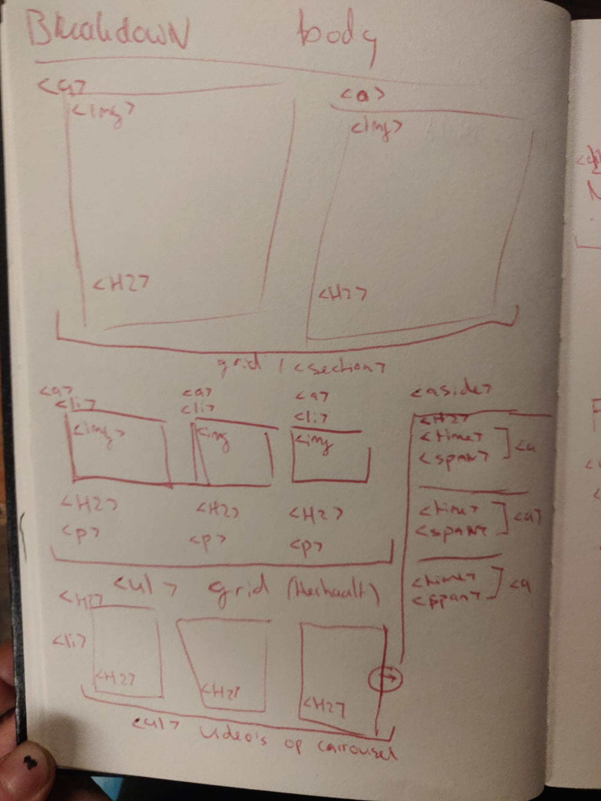
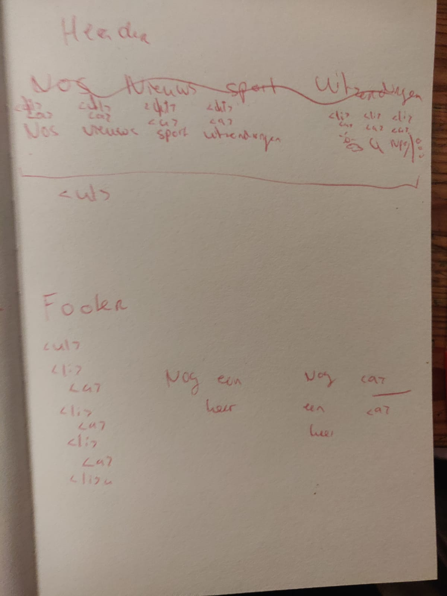

# Procesverslag
Markdown is een simpele manier om HTML te schrijven.  
Markdown cheat cheet: [Hulp bij het schrijven van Markdown](https://github.com/adam-p/markdown-here/wiki/Markdown-Cheatsheet).

Nb. De standaardstructuur en de spartaanse opmaak van de README.md zijn helemaal prima. Het gaat om de inhoud van je procesverslag. Besteedt de tijd voor pracht en praal aan je website.

Nb. Door *open* toe te voegen aan een *details* element kun je deze standaard open zetten. Fijn om dat steeds voor de relevante stuk(ken) te doen.

## Jij

uitwerken voor kick-off werkgroep

### Auteur:
mauro de langen 

#### Je startniveau:
blauw
#### Je focus:
responsive

## Je website

uitwerken voor kick-off werkgroep

### Je opdracht:
nos.nl maar met verschillende onderwerpen zodat ik niet live alles hoef te veranderen

#### Screenshot(s) van de eerste pagina (small screen):
home

#### Screenshot(s) van de tweede pagina (small screen):
hier de naam van de pagina  

## Breakdownschets (week 1)

uitwerken na afloop 2e werkgroep

### de hele pagina:

### dynamisch deel (carrousel):

## Voortgang 1 (week 2)

uitwerken voor 1e voortgang

### Stand van zaken
ik kreeg het plaatje en tekst niet samen bij elkaar. Het kwam er de hele tijd onder te staan.
de opfrissing van de codepen was erg handig.

## Voortgang 2 (week 3)

uitwerken voor 2e voortgang

### Stand van zaken
de plaatjes en tekst staan goed bij elkaar. Ik kan alleen niet voor elkaar krijgen om deze ene goede maat te vinden maar wil graag door met andere artikelen. Mijn project hier naast vraagt veel tijd ook.

## Toegankelijkheidstest (week 4)

uitwerken na test in 8e voortgang

### Stand van zaken
Deze week kon ik wat kleine dingetjes doen, lettertypes en kleuren opzoeken en toepassen,
ik kon wat animaties overnemen en heb een goed idee hoe ik de kleinere artikelen kan maken.

Alleen de balk aan de rechterkant snap ik totaal niet, het is een aside en dat kan ik nog niet.

## Voortgang 3 (week 4)

### Stand van zaken
mijn laptop is kapot! ik kon hier in deze week niet aan FED werken, of welk ander vak. hierom mis ik ook het grootste deel van screenshots. Ik heb deze niet terug kunnen vinden want heb een hele nieuwe laptop moeten aanschaffen.

## voortgang 4 (week 5)

uitwerken voor eindgesprek

### Stand van zaken
Ik heb mijn site van scratch weer moeten opbouwen terwijl ik al heel ver was. Ik heb toen zo ver als dit kunnen komen:

### Screenshot(s)

## Bronnenlijst

continu bijhouden terwijl je werkt

Nb. Wees specifiek ('css-tricks' als bron is bijv. niet specifiek genoeg).

1. bhttps://www.w3schools.com/tags/tag_aside.asp
2. https://www.w3schools.com/tags/tryit.asp?filename=tryhtml5_aside2
3. https://css-tricks.com/snippets/css/centering-a-website/
4. https://css-tricks.com/useful-nth-child-recipies/
5. https://css-tricks.com/almanac/properties/a/align-items/
6. https://css-tricks.com/snippets/css/a-guide-to-flexbox/
7. https://www.w3schools.com/howto/howto_css_rounded_images.asp
8. https://www.w3schools.com/cssref/sel_nth-child.asp
8. https://www.w3schools.com/css/css_link.asp
9. https://www.youtube.com/watch?v=jV8B24rSN5o

